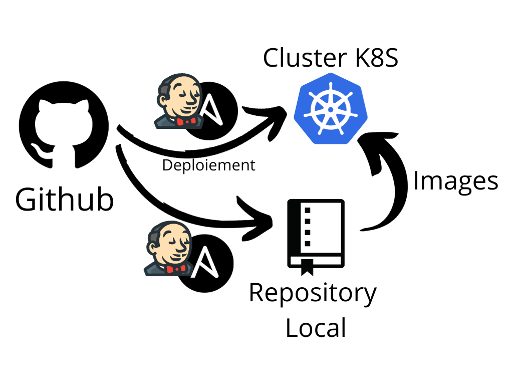

# projet-reseau
Projet de réseau

## Application

## Fonctionnement

Nous allons utiliser Github avec Jenkins pour automatiser les tests et le déploiement.
Puis pour la partie réseau, nous allons utiliser Ansible pour automatiser la configuration des machines pour mettre en place un cluster Kubernetes et ensuite déployer notre application.

